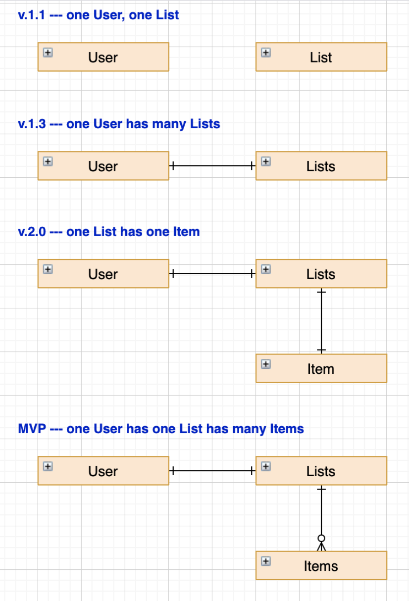

# Bucket List API

### Description
An app to record and track progress on your bucket list with the following capabilities:

- Allows user to create new account and sign in.
- Each authenticated user can create multiple entries for their own bucket list.
- The updated list will show up after a new entry is created.
- Authenticated user can update their entries as they see fit.
- Authenticated user can delete an entry, new updated list will show what they their on-going entries.
- Authenticated user can cross-out/restore any entry from their list.
- The completed entry will be rearranged and showed up at the end of the bucketlist.

### Related Links
- [Client Repository](https://github.com/bucket-list-party-dumpster/bucket-list-client)
- [API Repository](https://github.com/bucket-list-party-dumpster/bucket-list-express-api)
- [Client API](https://bucket-list-party-dumpster.github.io/bucket-list-client)
- [Deployed API](https://party-dumpster-bucket-list.herokuapp.com/)

### Technologies Used
- HTML, CSS/SCSS, Handlebars
- JavaScript, jQuery, AJAX
- Express, MongoDB/Mongoose

### User Stories
- As an unregistered user, I would like to sign up with email and password.
- As a registered user, I would like to sign in with email and password.
- As a signed in user, I would like to change password.
- As a signed in user, I would like to sign out.
- As a signed in user, I would like to create a bucket list item with a title and description.
- As a signed in user, I would like to update my bucket list item's title and description.
- As a signed in user, I would like to delete my bucket list item.
- As a signed in user, I would like to see all my bucket list items but not other users'.
- As a signed in user, I would like to cross off items to complete them.

## ERD

## Catalogue of RESTful Routes:

| Verb   | URI Pattern    | Result              |
|:-------|:---------------|:--------------------|
| GET    | `/entries`     | show list of all user's entries|
| POST   | `/entries`     | create a new entry        |
| PATCH  | `/entries/:id` | update an existing entry        |
| DELETE | `/entries/:id` | destroy an existing entry       |

## Development Process
Our team began with a meeting where we outlined our own perceived strengths and weaknesses, and laid out our personal goals for the assignment (what we'd like to practice/learn in the process). We quickly realized while our team members all had different technical skillsets, we all shared a strength in project management, so we chose to leverage this as much as possible. This proved to be the best decision we made throughout the process, as it forced us to work in close tandem and keep everone on the same page throughout the process and ensured there were no major merge conflicts or redudant workflows.

We organized our project through a Github Project kanban (https://github.com/orgs/bucket-list-party-dumpster). Standups were conducted each morning/afternoon and throughout the day as needed when regrouping after pair/individual programming tasks were completed. As we all felt equally unfamiliar with the Express API backend setup, we decided to go through it together so we could all gain more experience and help each other research and troubleshoot. Whether in a mob of four or - less often - pairs of two, this teamwork-centered process made us far more productive than we ever could have been on our own.

We typically approached mob/pair programming with one person sharing their screen and typing in the code, while the other three directed the coding, identified & recorded new issues in our Github Project kanban, and researched solutions (while recording useful links & information in issue comments). Where smaller problems arose, we would break off into pairs or work on things individally, but typically still remain in the same Zoom room to ensure our workflow and git commits stayed as linear as possible. This also helped move things along, as four sets of eyes are far more likely to catch a typo or help direct things forward when they're working together.

## Additional Resources

##### General Assembly Prompt & Templates
https://git.generalassemb.ly/ga-wdi-boston/team-project/blob/master/prompts.md#bucket-list
https://git.generalassemb.ly/ga-wdi-boston/browser-template
https://git.generalassemb.ly/ga-wdi-boston/express-api-template

##### General Assembly Tutorials
https://git.generalassemb.ly/ga-wdi-boston/express-api
https://git.generalassemb.ly/ga-wdi-boston/express-api-deployment-guide
https://git.generalassemb.ly/ga-wdi-boston/handlebars
https://git.generalassemb.ly/ga-wdi-boston/mongoose

##### Outside Sources
https://handlebarsjs.com/guide/builtin-helpers.html#if
https://github.com/adam-p/markdown-here/wiki/Markdown-Cheatsheet
https://thecodebarbarian.com/how-find-works-in-mongoose

## Unresolved Issues & Missed Goals
##### MVP:
- All goals met for MVP (see *User Stories* above)

##### Stretch Goals:
- Integrate with a third-party location-based API to:
  - allow users to search for a location or venue to add to their bucket list items.
  - autofill an input field.
  - drop pins on a map.
- Add social features to your site, such as following other users.
- Allow users to make certain list items public, but default to private.
- Allow users to upload an image when they complete an item.
